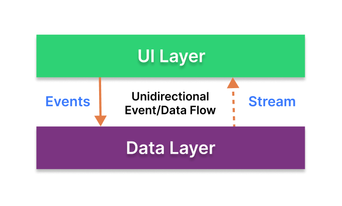

This is a Kotlin Multiplatform project targeting Android, iOS.

* `/composeApp` is for code that will be shared across your Compose Multiplatform applications.
  It contains several subfolders:
    - `commonMain` is for code that’s common for all targets.
    - Other folders are for Kotlin code that will be compiled for only the platform indicated in the
      folder name.
      For example, if you want to use Apple’s CoreCrypto for the iOS part of your Kotlin app,
      `iosMain` would be the right folder for such calls.

* `/iosApp` contains iOS applications. Even if you’re sharing your UI with Compose Multiplatform,
  you need this entry point for your iOS app. This is also where you should add SwiftUI code for
  your project.

* Tech-stack
    * [100% Kotlin](https://kotlinlang.org/)
        + [Coroutines](https://kotlinlang.org/docs/reference/coroutines-overview.html) - perform background operations
        + [Kotlin Flow](https://kotlinlang.org/docs/flow.html) - data flow across all app layers, including views
        + [Kotlin Symbol Processing](https://kotlinlang.org/docs/ksp-overview.html) - enable compiler plugins
        + [Kotlin Serialization](https://kotlinlang.org/docs/serialization.html) - parse [JSON](https://www.json.org/json-en.html)
    * [Jetpack](https://developer.android.com/jetpack)
        * [Compose](https://developer.android.com/jetpack/compose) - modern, native UI kit
        * [Lifecycle](https://developer.android.com/topic/libraries/architecture/lifecycle) - perform an action when
          lifecycle state changes
        * [ViewModel](https://developer.android.com/topic/libraries/architecture/viewmodel) - store and manage UI-related
          data in a lifecycle-aware way
        * [Sqldelight](https://github.com/cashapp/sqldelight) - store offline cache
    * [Koin](https://insert-koin.io/) - dependency injection (dependency retrieval)
* Modern Architecture
    * [Clean Architecture](https://blog.cleancoder.com/uncle-bob/2012/08/13/the-clean-architecture.html)
    * Single activity architecture
    * MVVM + MVI (presentation layer)
    * [Android Architecture components](https://developer.android.com/topic/libraries/architecture)
      ([ViewModel](https://developer.android.com/topic/libraries/architecture/viewmodel)
      , [Kotlin Flow](https://kotlinlang.org/docs/flow.html)
    * [Android KTX](https://developer.android.com/kotlin/ktx) - Jetpack Kotlin extensions
* UI
    * Reactive UI
    * [Jetpack Compose](https://developer.android.com/jetpack/compose) - modern, native UI kit (used for Fragments)
    * [Material Design 3](https://m3.material.io/) - application design system providing UI components

## Architecture
**Contact Manager** is based on the MVVM architecture and the Repository pattern, which follows the [Google's official architecture guidance](https://developer.android.com/topic/architecture).

The overall architecture of **Contact Manager** is composed of two layers; the UI layer and the data layer. Each layer has dedicated components and they have each different responsibilities, as defined below:

**Pokedex** was built with [Guide to app architecture](https://developer.android.com/topic/architecture), so it would be a great sample to show how the architecture works in real-world projects.

### Architecture Overview

- Each layer follows [unidirectional event/data flow](https://developer.android.com/topic/architecture/ui-layer#udf); the UI layer emits user events to the data layer, and the data layer exposes data as a stream to other layers.
- The data layer is designed to work independently from other layers and must be pure, which means it doesn't have any dependencies on the other layers.

With this loosely coupled architecture, you can increase the reusability of components and scalability of your app.

### UI Layer

The UI layer consists of UI elements to configure screens that could interact with users and [ViewModel](https://developer.android.com/topic/libraries/architecture/viewmodel) that holds app states and restores data when configuration changes.

### Data Layer

The data Layer consists of repositories, which include business logic, such as querying data from the local database and requesting remote data from the network. It is implemented as an offline-first source of business logic and follows the [single source of truth](https://en.wikipedia.org/wiki/Single_source_of_truth) principle. 
